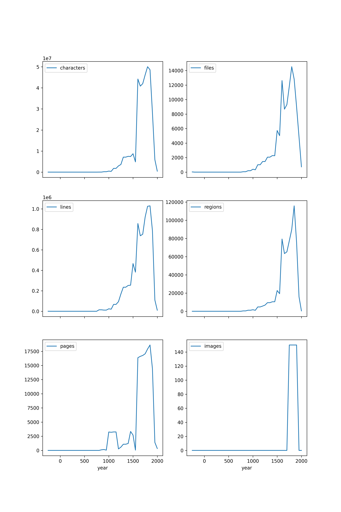

HTR-United
=========

[](./README.md) [](https://htr-united.github.io) 


## Qu'est-ce que HTR-United

HTR-United est une organisation github sans autre forme de personnalité juridique. Elle vise à **mettre en commun les transcriptions HTR/OCR de textes de toutes périodes et de tout style, principalement en français mais de manière non restricive**. Elle est née du simple besoin - pour des projets - d'avoir de potentiels vérités de terrain pour entraîner des modèles rapidement sur des corpus plus petits.

## Qu'est-ce qui est partagé ?

Les sets de données partagés ou signalés grâce à HTR-United se présentent sous la forme minimale suivante : 
- un ensemble de fichiers XML ALTO 4 et/ou XML PAGE contenant soit uniquement des données de segmentation, soit des données de segmentation et des données de transcription ;
- un ensemble d'images correspondantes (il peut s'agir d'un lien vers un paquet hébergé sur une autre plateforme ou bien de contacts auprès de qui demander l'accès aux images) - le lien entre les images et les fichiers XML doit pouvoir être reconstitué sans traitement intermédiaire ;
- une documentation sur les pratiques d'annotation suivie pour la segmentation et la transcription. Dans le cas d'un répertoire Github, cette documentation se trouve résumée dans le README.

Un corpus peut être sous-divisé en plusieurs ensembles si cela est jugé nécessaire. 

## Que des données ?

À terme, l'objectif de cette organisation sera probablement de partager aussi - sous licence libre - des modèles pour les moteurs HTR demandés, afin que les projets les moins dotés puissent profiter de modèles. Ainsi, si vous partagez vos données, et suivant le rythme possible des autres partenaires, vous profiterez sûrement d'un modèle sous peu.

Cependant, n'oubliez pas: il existe un cercle vertueux Transcription<->Entraînement qui permettra à terme - nous l'espérons - d'améliorer pour les plus jeunes projets les transcriptions partant de 0.

## Comment cela fonctionne ?

Il existe deux cas de figure:

1. [Vous avez déjà un dépôt de données](#vous-avez-déjà-un-dépôt-de-données)  
2. [Vous n'en avez pas et préférez fournir directement l'organisation](#vous-nen-avez-pas)
    
### Vous avez déjà un dépôt de données

C'est plutôt pratique: vous gardez la main, pas de problèmes de rajout à l'organisation. Mais, histoire de faire grossir la visibilité de votre set de données, il nous parait important de le décrire ici ! En effet, si vous profitez des données de HTR-United, voire de ses modèles, autant renvoyer la pareille. 

Pour ce faire, il suffit d'[ouvrir une issue](https://github.com/HTR-United/htr-united/issues/new) ou de proposer une modification sur le répertoire de dépôt en rajoutant une ligne formatée telle que:

```yaml
        name: "Titre"
        url: 'Lien vers le dépôt'
        description: 'Description'
        language: French
        other-languages:
            - "Optionel"
        time: 1800--1897
        hands: 5  # Nombre de mains
        license:
            - {name: 'CC-BY 4.0', url: 'https://creativecommons.org/licenses/by/4.0/'} # Vous pouvez bien sûr changer la licence
        format: Alto-XML
        volume:
            - {count: "NOMBRE DE LIGNES", metric: lines} # ou
            - {count: "NOMBRE DE PAGES", metric: pages} # ou
```

### Vous n'en avez pas

Et bien, nous serons heureux de vous aidez. [Ouvrez un ticket ici](https://github.com/HTR-United/htr-united/issues/new) et nous serons heureux de vous aider à créer et partager votre dépôt, sur HTR-United. Des compétences en `git` sont bienvenues mais, si vous voulez partager des données, on vous aidera, c'est le but de cette organisation !

### Vue d'ensemble

Il est possible de consulter le contenu du catalogue depuis notre site internet : [ici](https://htr-united.github.io/catalog.html).

Voici une vue d'ensemble des périodes couvertes par les jeux de données documentés dans le catalogue d'HTR-United !




### Publications

- Alix Chagué, Thibault Clérice, Laurent Romary. HTR-United : Mutualisons la vérité de terrain !. *DHNord2021 - Publier, partager, réutiliser les données de la recherche : les data papers et leurs enjeux*, MESHS, Nov 2021, Lille, France. [⟨hal-03398740⟩](https://hal.inria.fr/hal-03398740v1)


---

Logo by [Alix Chagué](https://alix-tz.github.io).
